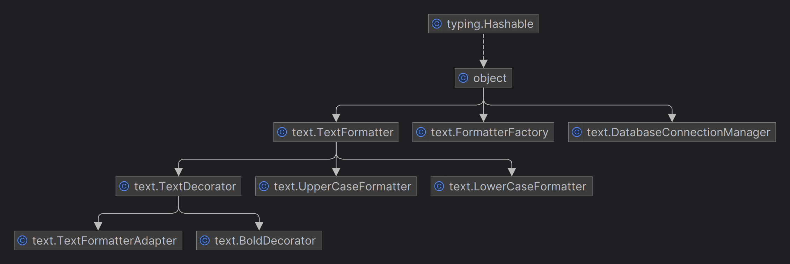

# SDP Final Project
**Group:** SE-2211  
**Creator:** Anykbaiuly Bagdat

## Project Description
This project showcases the implementation of several design patterns in a Python script, demonstrating their application in a modular and structured manner. The implemented design patterns include Singleton, Factory, Strategy, Decorator, and Adapter. Let's delve into the details of each pattern and their respective roles in the project:

## Singleton Pattern
The DatabaseConnectionManager class ensures the creation of only one instance of the database connection manager. By employing the Singleton pattern, this class guarantees that there is a single point of access to the database connection, preventing multiple connections and maintaining control over the connection state.

## Factory Pattern
The FormatterFactory class acts as a factory for creating different text formatters based on the provided formatter type. This pattern abstracts the instantiation process, allowing for easy extension when adding new formatter types. In this project, it supports the creation of UpperCaseFormatter and LowerCaseFormatter instances.

## Strategy Pattern
The TextFormatter class serves as an abstract strategy interface for formatting text. Concrete implementations, such as UpperCaseFormatter and LowerCaseFormatter, provide different strategies for modifying the case of the input text. The Strategy pattern allows for interchangeable algorithms while encapsulating each one.

## Decorator Pattern
The TextDecorator and BoldDecorator classes demonstrate the Decorator pattern. TextDecorator is an abstract decorator that wraps a TextFormatter, while BoldDecorator adds extra functionality by making the text bold. This pattern enables the dynamic addition of responsibilities to objects, enhancing the flexibility of text formatting.

## Adapter Pattern
The TextFormatterAdapter class acts as an adapter for the TextFormatter class, allowing it to be used as a TextDecorator. This enables the integration of the TextFormatter into the decorator pattern. The Adapter pattern is used to make existing classes work with others without modifying their source code.

## UML Diagram

